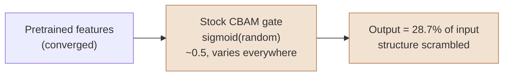
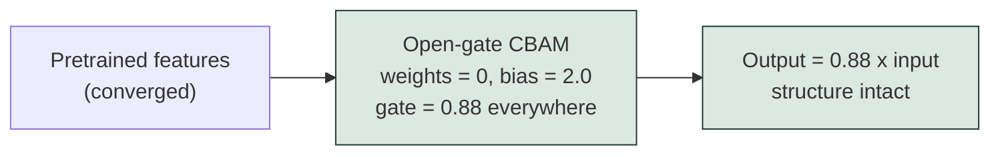
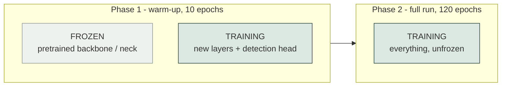
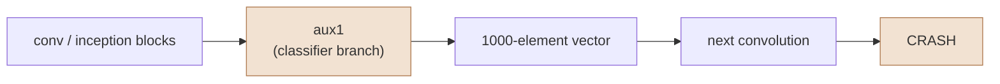
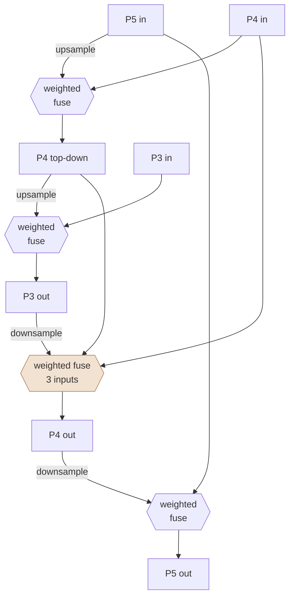
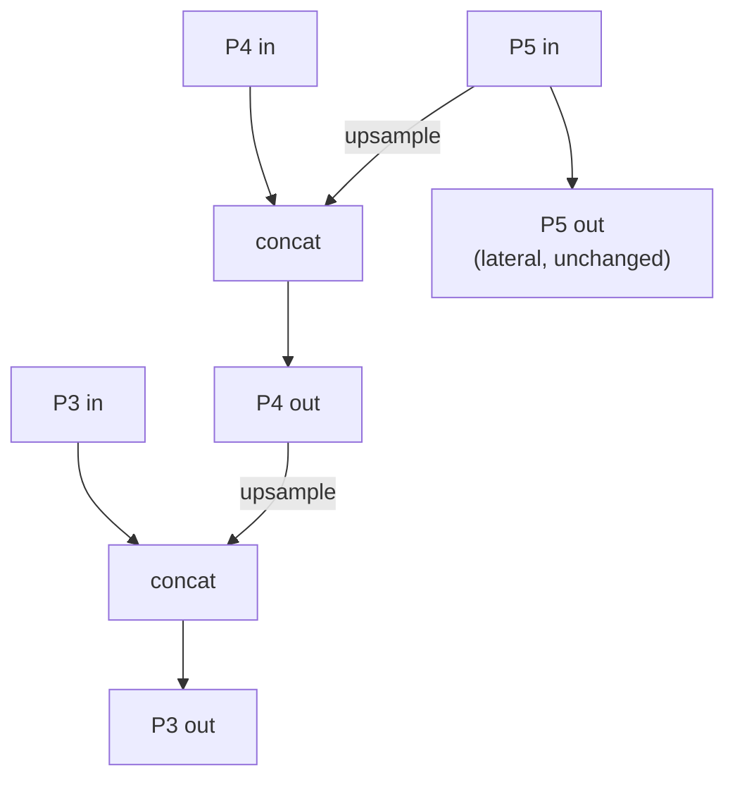
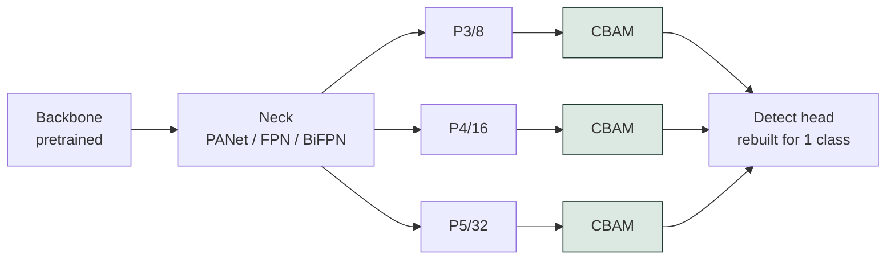

# Architecture changes

What changed in the models and in how they are trained, why, and what was
measured to justify it.

Every change below alters the networks or their optimisation, so **no result
produced before them is comparable with one produced after**.

---

## 1. CBAM gates now start open

### The problem

CBAM refines features with two gates: one weighting channels, one weighting
spatial positions. Both are `nn.Conv2d` layers with default initialisation, so
at step zero each gate emits values scattered around 0.5 that differ per
channel and per pixel.

That matters because of where the block sits. The backbone and neck arrive
already converged from a pretrained checkpoint. The first forward pass
multiplies those finished features by a random mask.



Measured on a random input:

| | Mean gain | Spread across elements | Correlation with input |
|---|---|---|---|
| Stock CBAM | **0.287** | 0.0211 | 0.9973 |

Only 28.7% of the feature magnitude survives, and the mask is uneven.

### The evidence it mattered

| Model | Detection | False alarms |
|---|---|---|
| YOLOv8s | 78.0% | 9.6% |
| YOLOv8s **+CBAM** | **72.2%** (down 5.8) | 9.8% |
| YOLOv11s | 77.0% | 9.2% |
| YOLOv11s **+CBAM** | 76.0% | **13.5%** (up 4.3) |

Both also regressed on the *synthetic validation* split, not just on real
photographs. Overfitting would show the opposite — better synthetic, worse real
— so the cause was a training problem, not a generalisation one.

### The fix

Zero both gate convolutions and open them with a positive bias. Zero weights
make each gate constant across channels and pixels, so the block applies one
uniform gain that the next layer absorbs.



| | Mean gain | Spread | Correlation with input |
|---|---|---|---|
| Stock CBAM | 0.287 | 0.0211 | 0.9973 |
| **Open-gate CBAM** | 0.776 | **0.0000** | **1.0000** |

Spread of exactly zero and correlation of exactly one means the output is a
pure scalar multiple of the input: a true pass-through. The gates still receive
gradient, so they still learn to attend — they just start from "pass everything
through" rather than from noise.

### Why bias 2.0 rather than something closer to identity

| Bias | Gate value | Gradient available |
|---|---|---|
| 0.0 | 0.500 | 0.250 |
| **2.0** | **0.881** | **0.105** |
| 4.0 | 0.982 | 0.018 |
| 6.0 | 0.998 | 0.003 |

A larger bias looks closer to identity but saturates the sigmoid and starves
the parameters meant to learn. Because zero weights make the gain *uniform*,
its exact value is absorbed downstream and does not matter — the gradient does.

`src/lib_modules.py`

---

## 2. Warm-up phase

### The problem

Every architecture except the two baselines bolts randomly initialised layers
onto pretrained ones:

| Architecture | Pretrained | Newly initialised |
|---|---|---|
| YOLOv8s / YOLOv11s | backbone + neck | detection head |
| +CBAM variants | backbone + neck | CBAM blocks + head |
| YOLOv11s+BiFPN+CBAM | backbone only (0-10) | whole neck + CBAM + head |
| ResNet18 / GoogLeNet / EfficientNet arms | backbone only (layer 0) | whole neck + CBAM + head |

Training all of it together from step zero back-propagates the new layers'
noise into weights that were already correct.

### The fix

Freeze whatever inherited pretrained weights, let the new layers settle against
them, then release everything.



One rule for every arm — *freeze what is pretrained* — even though the frozen
set necessarily differs, since only some arms have new layers to settle.

Freeze depths were read off the actual checkpoint transfer, not guessed:

| Config | Layers frozen |
|---|---|
| `yolov8s`, `yolov8s-cbam` | 0-21 |
| `yolo11s`, `yolo11s-cbam` | 0-22 |
| `yolo11s-bifpn-cbam` | 0-10 (backbone only; neck replaced) |
| every torchvision-backbone arm | 0 (the single `TVBackbone` layer) |

**Verified:** after a one-epoch warm-up of YOLOv8s+CBAM, all **270** pretrained
tensors came back bit-identical while the **97** new ones trained.

### Two deliberate choices

**Warm-up epochs are additional, not deducted.** 10 warm-up + 120 full, not
10 + 110. Deducting them would confound any gain from warming up with the loss
from ten fewer full epochs. Every arm gets the same extra budget.

**Continuation uses `last.pt`, not `best.pt`.** Warm-up is initialisation, not
model selection, and the "best" epoch of a frozen run is not meaningful.

`src/05_train.py`, flag `--warmup-epochs` (default 10, `0` disables)

---

## 3. Three backbones instead of one

Each backbone is paired with **both** necks, so the FPN-against-BiFPN question
is asked three times rather than once.

| Backbone | torchvision model | P3 (stride 8) | P4 (stride 16) | P5 (stride 32) |
|---|---|---|---|---|
| ResNet18 | `resnet18` | 128 ch | 256 ch | 512 ch |
| GoogLeNet | `googlenet` | 480 ch | 832 ch | 1024 ch |
| EfficientNet-B0 | `efficientnet_b0` | 40 ch | 112 ch | 320 ch |

All measured at 640 px, not looked up.

### Why GoogLeNet and not Inception v3

Inception v3 uses **unpadded** stem convolutions, so its feature maps shrink off
the power-of-two grid a detector needs:

| Input 640 px | Inception v3 | Required |
|---|---|---|
| P3 | 77 x 77 (stride 8.31) | 80 x 80 (stride 8) |
| P4 | 38 x 38 (stride 16.84) | 40 x 40 (stride 16) |
| P5 | 18 x 18 (stride 35.56) | 20 x 20 (stride 32) |

This is not a tuning problem, it is a geometry one. Upsampling P5 by two gives
**36**, against a P4 of **38** — the neck cannot even concatenate. And the
detection head derives its strides from feature-map size, so it would decode
boxes against fractional strides.

Forcing it would mean padding the stem convolutions, both maxpools, and the
stride-2 branches inside `InceptionB` and `InceptionD` — surgery on a
pretrained architecture whose weights were trained with valid padding.

GoogLeNet **is** Inception: the original 2014 paper, Inception v1, and
torchvision names it so. It gives exactly 8, 16 and 32.

### Why EfficientNet's P5 is 320 channels, not 1280

EfficientNet ends with a 1x1 projection to 1280 channels that exists to feed a
classifier. The detector takes the last *block* output at each stride instead,
which is what EfficientDet does.

### TVBackbone

Ultralytics ships a `TorchVision` wrapper that does almost this, and the
original ResNet arms used it. It could not be kept, because it offers no way to
build a model with its **auxiliary classifier removed**.

GoogLeNet registers two auxiliary branches partway through its children.
Unwrapped into a plain sequence, every child runs in order — so those branches
turn a feature map into a 1000-element class vector and hand it to the next
convolution, which fails immediately.



`TVBackbone` assigns those branches `None`, which drops them from the module
registry so they never appear in `children()`. The rest of the unwrapping
follows Ultralytics' own, including its descent into a first-level `Sequential`
— without which truncation would remove all of EfficientNet rather than its
head.

`src/lib_modules.py`

---

## 4. BiFPN gets two passes, and the necks are generated

BiFPN had a single block. EfficientDet, where the design comes from, repeats it
three or more times.

### What one BiFPN pass does



The highlighted node is what separates BiFPN from a plain bidirectional
pyramid: `P4 out` fuses three things — its own **input**, its top-down result,
and the level below. That input-to-output skip is the defining feature.

"Weighted fuse" is also not concatenation. Each input carries a learnable
scalar, ReLU-clamped and normalised to sum to one, so the network can
*suppress* a level that carries nothing useful at a given scale.

### FPN, for contrast



Top-down only, no learnable weights, no skip.

### What is held equal

Both necks are emitted by `src/generate_necks.py` from **one width and one pass
count**:

```bash
python src/generate_necks.py --width 128 --repeats 2
```

The repeat count applies to **both** necks. Giving BiFPN two passes while FPN
kept one would confound the fusion topology those arms exist to compare with
plain depth.

For each backbone, its FPN arm and its BiFPN arm share: the same backbone, the
same neck width, the same number of passes, and the same CBAM block on every
level. The only remaining difference is the fusion topology.

---

## Where CBAM sits



CBAM is **appended after the neck**, never inserted inside it. Not cosmetic:
the pretrained checkpoint is matched to the network *by layer index*, so
inserting a layer mid-network renumbers everything after it and throws those
weights away. Appending preserves every existing index.

**Verified:** COCO weights transfer into layers 0-21 on YOLOv8s and 0-22 on
YOLOv11s, with only the detection head unmatched — and that head is rebuilt for
one class anyway.

---

## The eleven models

| Config | Parameters | GFLOPs |
|---|---|---|
| `yolov8s-cbam` | 11.51 M | 28.8 |
| `yolo11s-cbam` | 9.80 M | 21.7 |
| `resnet18-fpn-cbam` | 13.75 M | 46.5 |
| `resnet18-bifpn-cbam` | 13.31 M | 39.0 |
| `googlenet-fpn-cbam` | 8.36 M | 42.3 |
| `googlenet-bifpn-cbam` | 7.92 M | 34.7 |
| `efficientnet-fpn-cbam` | 6.53 M | 23.3 |
| `efficientnet-bifpn-cbam` | 6.09 M | 15.7 |
| `yolo11s-bifpn-cbam` | 6.81 M | 17.2 |

Plus the two unmodified baselines, YOLOv8s and YOLOv11s.

All nine configurations build, forward-pass, and report stride `[8, 16, 32]`
exactly.

---

## Retraining is required

Every change here alters the networks or their optimisation. Any earlier result
describes different models.

```bash
python src/05_train.py --pool 60 --model models/resnet18-bifpn-cbam.yaml --tag r18_bifpn_cbam
```

Budget is roughly 130 epochs per arm (10 warm-up + 120). The full command list
is in `docs/HANDOFF.md`.
